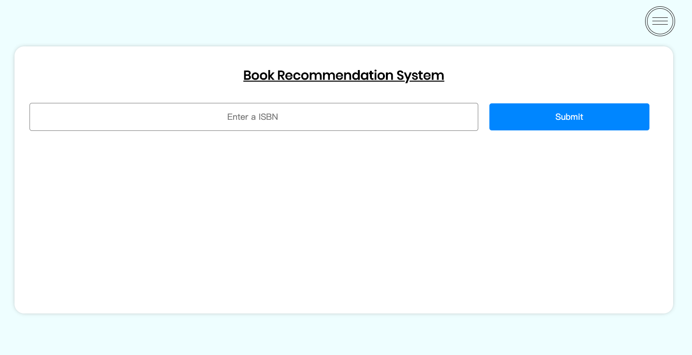
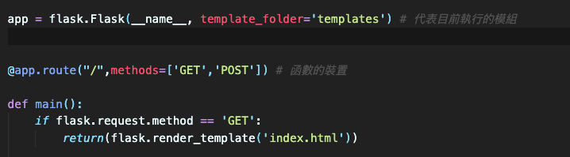
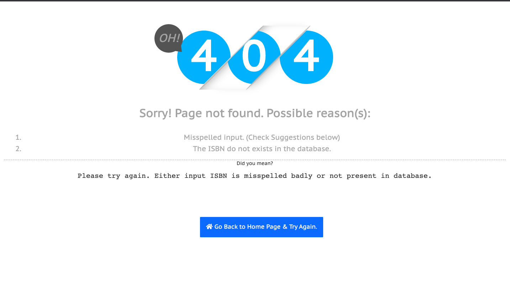
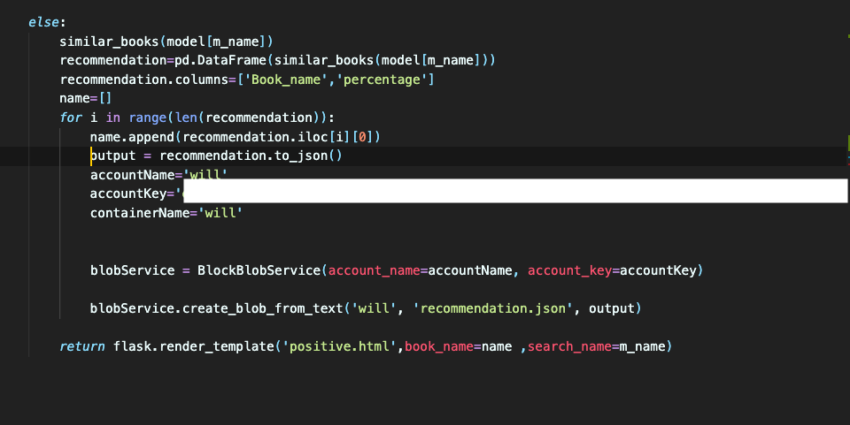
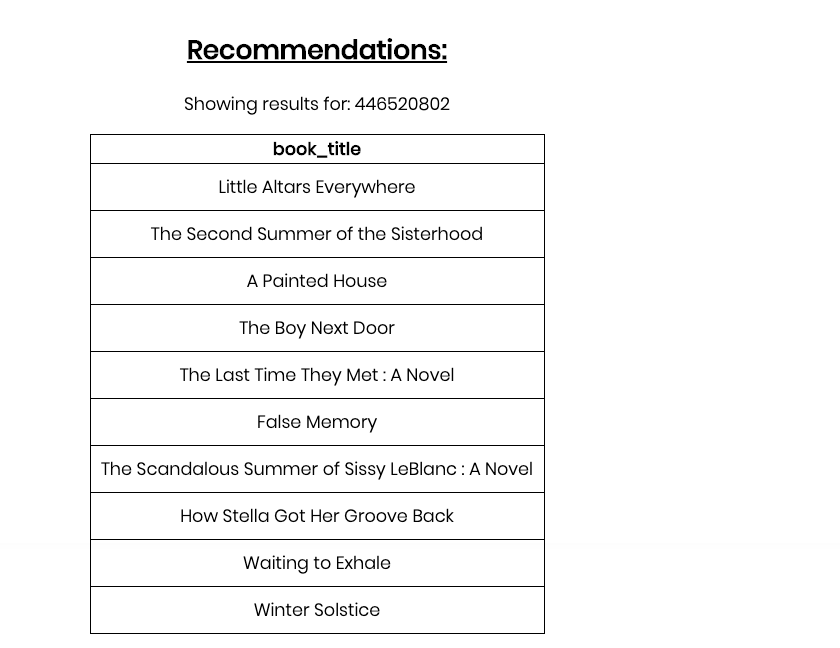
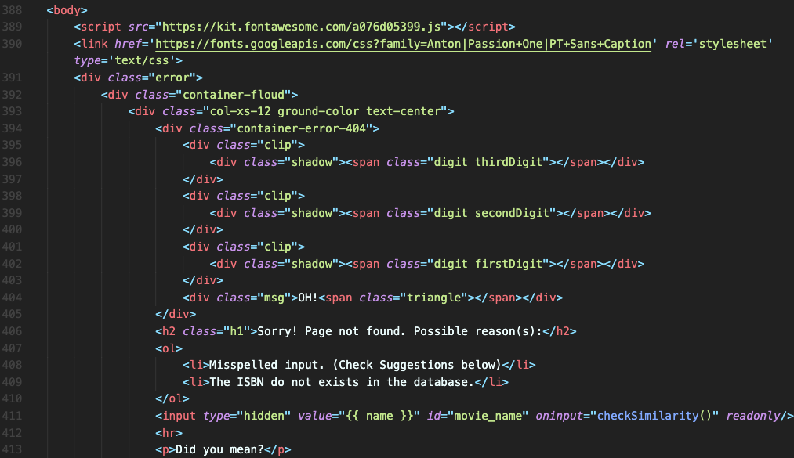
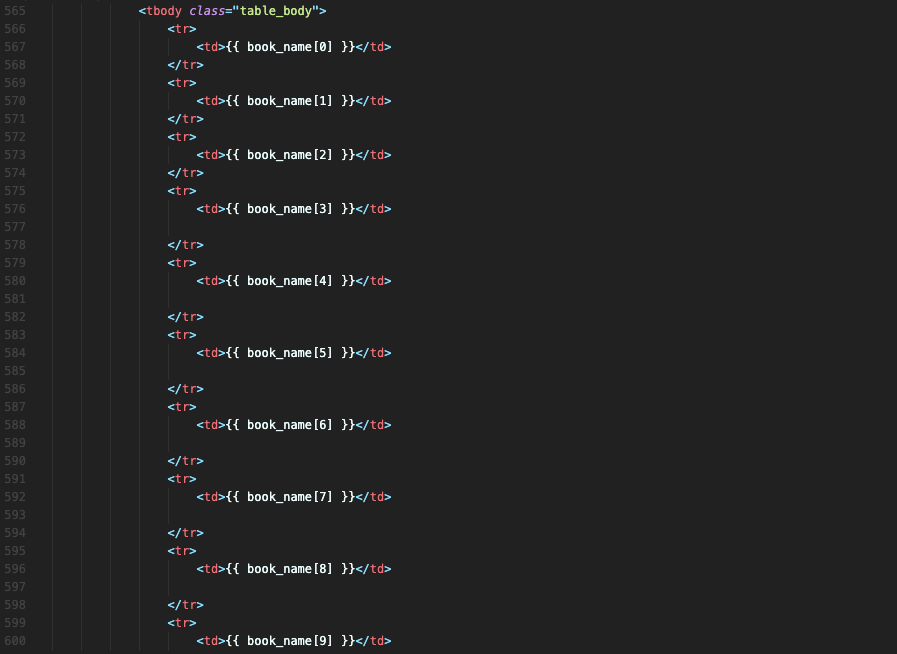

# Flask tutorial document 

## Introducion to Flask

Flask is a web framework . provides you with tool ,libraries and technologies that al-low you to build a web application .

## Example 

* **Hello world** application in flask

        import flask

        # Create the application.
        APP = flask.Flask(__name__)

        @APP.route('/')
        def index():
            """ Displays the index page accessible at '/'
            """
            return flask.render_template('index.html')

        if __name__ == '__main__':
            APP.debug=True
            APP.run()

* Template `index.html`

        <!DOCTYPE html>
        <html lang='en'>
        <head>
        <meta charset="utf-8" />
        <title>Hello world!</title>
        <link type="text/css" rel="stylesheet"
                href="{{ url_for('static',
                    filename='hello.css')}}" />
        </head>
        <body>

        It works!

        </body>
        </html>

* It works 

    

## Flask archicture in this project

* `index.html` 

1. We hope that  enters a **ISBN**, click on the submit button and the form is submitted .

    

2. This **ISBN** into the **m_name** variable in python. we accept the form submission using the **post** method.

    

3. We design two options:

* if the input **ISBN** is misspell or does not exist in the database

 > If wrong, show error page

    

* If a correct **ISBN** is in the database,that show the recommendations, and that recommendations result upload to Azure stroage

    

    

    

    

* `Negative.html`

1. Negative.html is rendered if the input from the user does not match with list which contains all the ISBN present in the database.

    

    

* `Positive.html`

2. Positive.html is render if the input correct matches with the database. if so , we call similar_books function by passing the book name. we sort the result and return back top 10 results. we create a tabular layout and print the 10 book to the **positive.html** 

    

     

