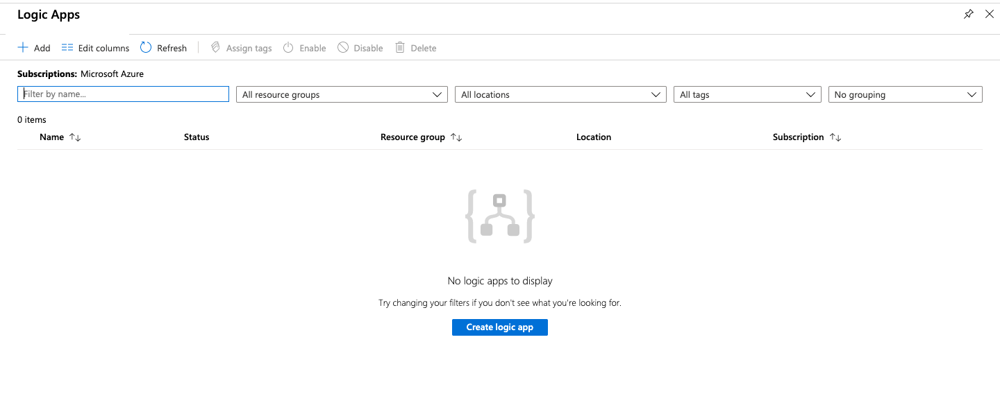

# Book recommendation system 

## Scenario 

part 1:

In this part , we use the **Book-Crossing** datasets to showcase how can use [Azure notebook](https://docs.microsoft.com/en-us/azure/notebooks/azure-notebooks-overview) for built book rcommender System base on **Word2Vec** model , and goal is to **predict What book do users favorite**

Part 2: 

In this part , we can develpomnet web page  using **Flask API** and then recommendation outcome upload to blob , use **Logic APP**  monitor storage when a blob is added or modified , trigger **Send email** function

## Prerequisite

> To have Microsoft Account or a work or school account

> Install [Visual Studio Code](https://code.visualstudio.com/)

> Install Anaconda or [Miniconda](https://docs.conda.io/en/latest/miniconda.html "Miniconda下載頁面")

> Install Git

## Sign in  Azure Notebooks

1. Select Sign in on the top right of Azure notebook (notebooks.azure.com)

    

2. Enter the email address of a Microsoft Account or a work or school account and select **Next**.

    

3. Enter your password when prompted

    

4. Azure Notebooks asks for permission to access your account. Select **Yes** to continue

    

5. After successfully signing in, Azure Notebooks navigates to your public profile page

    

## Upload local file in Azure Notebooks

1. From your public profile page, select **My Projects** at the top of the page

    

2. Enter appropriate values for the notebook in the Project name

    

    

3. On the project page, select Upload ,then select **From computer** 

    

4. Select **Choose Files** 

    

5. Select file **book folder**  which is in this repository in your computer folder

    

6. click **Upload**, and wait for about 5 minutes.

    

## Train processing

*  Detail train processing  information for [book_recommendation](main/README)

## Train Result
    similar_books(model['0446520802'])

    

    similar_books(model['034545104X'])

    

## Create Storage as Container

1. Sign in to the Azure portal ,and in the upper-left corner of Azure portal, select **Storage Accounts**

    

2. Select your **Storage Account**, if you have not **Storage Account**, create new

    

3. Click **Container**

4. Click **add Container**

* Name: **your unique name**
* Public access level : **Container**

5. Click **OK**

## Implement Flask API

* **Detail Flask design** information for [Flask documents](Flask/README)

1-1. Open  **Flask** folder in VS code

    

1-2. Modify code for storage SDK information in line 103 to 110

 * Account Name: `your storage Account name`

 * Account key: `your storage Account Key`

* ContainerName: `yor container name`

    

    

* Account key: `your storage Account Key`

    

* ContainerName: `yor container name`

    

1-3. Enter `cd Flask` 

    

1-4. Implement  **Flask API**  on localhost using `python app.py`

    

1-5. **Click + CTRL** click URL to page

    

1-6. Enter **ISBN** , and Click **Submit**

    

* If the input ISBN is misspelled or does not exist in the database ,then show **error page** 

    

* If a **correct ISBN** is entred & present in the database , then show the recommendations.  

    

## Check Json file whether upload to Storage

    

##  Create Logic APP 

1-1.  On the Azure portal ,and in the upper-left corner of Azure portal, select **Create a resource**.

    

1-2. Use the search bar to find **logic apps**,and click **Select**

    

1-3. Click **Create logic app**

    

* For Resource group , Select **your resource group**

* For **Logic App name**,Type a **your name**

* Click **Create**

    

1-4. The Logic Apps Designer opens and show a page with an introduce video and commonly used triggers. Under Templates, Select **Blank Logic App**

    

##  Add blob trigger

* In the search box , enter `Blob storage`,From the triggres list , Select the **When a blob is added or modified**

    

1-1. Enter trigger information

* For **Connect Name**, Type a **your name**

* for **Storage Account** ,Select **your storage**

* Click **Create**

    

1-2. Select Container

    

1-3. Under the **When a blob is added or modified**, select **New step**

    

1-4. In the search box , enter `Blob storage`,From the Action list , Select the **Get Blob content**

    

* Select json file in your Blob ,and select **New step**

    

1-5.  In the search box , enter `Data Operations`,
From the Action list , Select the **Parse Json**

    

* In the **Parse Json**, Click **Add dynamic content** , Select **Expression** , and in the **function box** ,Input `decodeBase64(body(‘Get_blob_content’)[‘$content’])`

    

* In the **Schema** , input`{}`

* Click **OK**

    

* Click **Save**

    

## Test logic app

1-1. In the Flask API web ,Enter **ISBN**

    

1-2. In the Logic apps , Select **overview**, and Click **Run Trigger**, wait after seconds , check**Run history** ,check whether succeeded

    

1-3. Click **succeeded Run history** , and then select **Parson JSON**, can see outputs , **Copy all** 

    

1-4. In the Logic App Designer , Select **Parson JSON**, and click **Use sample payload to generate scheme**

    

1-5. In the sample JSON payload, **paste content** ,and Click **Done**

    

## Add send email  trigger

1-1. Click **New step**

1-2. In the search box , enter `Office 365 Outlook`,From the Action list , Select the **Send an email**

    

1-3. Sign in Office 365 Outlook

    

1-4. Select Microsoft Office Account 

    

1-5. Enter email information:

* To: type **your email account**

* subject: type`Rcommendation for you`

* Body design reference this 

    

1-6. Add dynamic content

* Click **Add dynamic content**

* Select Parse JSON ,and click **see more**

* for each item , Select **Second** object 

    

## check mail

1-1. 1-1. In the Flask API web ,Enter **ISBN**

    

1-2. In the Logic apps , Select **overview**, and Click **Run Trigger**, wait after seconds 

    

1-3. Check email

    

##  Conclusion

Congratulations! You now have learned how to:

1. Train Recommendation model on Azure notebook

2. Use Flask API coneect model 

3. Recommendation outcome present in html

4. Use Vscode upload file to storage

5. Use logic app to send email 

## Clean up Resource

In the resource group,**Delete resource**

* Storage account

* Logic App

* API connection

