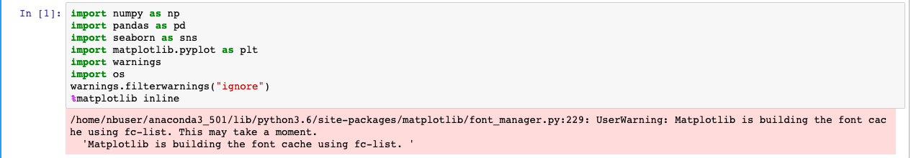
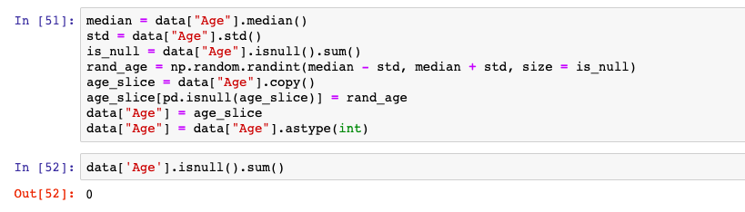

# Built  book rcommender System on Azure notebook 

## Scenario 

In this Lab , we use the **Book-Crossing** datasets to showcase how can use [Azure notebook](https://docs.microsoft.com/en-us/azure/notebooks/azure-notebooks-overview) for built book rcommender System base on **Word2Vec** model , and goal is to **predict What book do users favorite**

    

## Prerequisite

* To have Microsoft Account or a work or school account

* Download **book folder**  which is in this repository in your computer folder

## Run notebook in Azure notebook

* Click **book_Recommendation System.ipynb**

    

    

* Load libraries

    

* Load  and view for Book Data 

    

* Define book data columns and check
    

    

* Load User data 

        
* Define User data columns

    

    

* Load Book rating data 
        
* Define book rating columns and check

    

* Merge user and ratings data  by `UserID` 

    

* Merge book daya by `ISBN` and check columns

    

* Drop columns

    * define Drop_columns 

    * Drop columns 

    

    

* Check data size 

    

## EDA(Exploratory Data Analysis)

* Observe data type and observe data value 
    

    

* Observe data columns is **null value**

    

* Count distinct observations over requested axis

       

    

* Plot columns`[Age]` distributed

    

*   Observe in colums`[Age]` if age over 100

    

*  Replace `0` value in columns`[bookRatings]` if value is **null**

        

    

* plot columns`[bookRating]` distributed

    

* Calculate bookRating mean to the second point

    

* Observe and plot columns`[yearOfpublication]` distributes

    

* Group multiple set by **country** and **bookratings**

    

## Feature Engineering

* Cast to numeric

* Handle outliers

* Impute **unknown** value in Categorical feautes

* Check cat features 

    

* Remain **median plus or minus one unit of standard deviation** in  columns`[age]`

        
    

    

## Extract features

* Extract feature in columns`[Location]` is  **USA**

* check data 

    

## Prepeare dataset

* Define data equal df

* Find Relevant score >= 6
        

* Check value  groupby `ISBN` and `User-ID`

        

    

* Filter x > length of 5 

    

## Embedings (word2vec)

* Load package

        

    

* Calculator users count, and set type of **list**

    

* Extract 90% of customer ID

*  Split data of train and validation set 

    

* Append list of  columns userID and ISBN in train to reads_train

    

*  Append list of  columns userID and ISBN in validation to reads_val

    

*  Train word2vec model

 

    

* Precompute L2-normalized vectors

* Check text and weight shape in model 

    

*  Extract **ISBN** and **BookTitle** and Remove duplicates 

    

    

* Choose Title equal **Lord of the Rings** to sample

    

*  Extract most similar products for the input vector

*  Extract name and similarity score of the similar products

    

* Predict Recommend

        similar_books(model['0446520802'])

    

    
